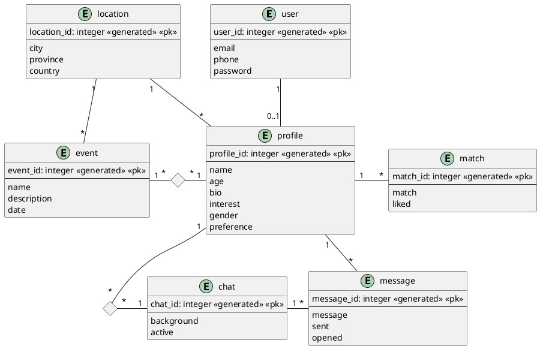

```plantuml
@startuml

entity user {
user_id: integer <<generated>> <<pk>>
--
email
phone
password
}

entity profile {
profile_id: integer <<generated>> <<pk>>
--
name
age
bio
interest
gender
preference
}

entity match {
match_id: integer <<generated>> <<pk>>
--
match
liked
}

entity location {
location_id: integer <<generated>> <<pk>>
--
city
province
country
}

entity chat {
chat_id: integer <<generated>> <<pk>>
--
background
active
}

entity message {
message_id: integer <<generated>> <<pk>>
--
message
sent
opened
}

entity event {
event_id: integer <<generated>> <<pk>>
--
name
description
date
}

<> profile_chat_diamond

<> profile_event_diamond

user "1"--"0..1" profile:"         "

profile "1"--"*" profile_chat_diamond

profile_chat_diamond "*"-"1" chat: "    "

chat "1"-"*" message

profile "1"--"*" message

location "1 "--" * " profile

profile_event_diamond "*"-"1" profile

event "1"-"*" profile_event_diamond

location "1"--"*" event

profile "1"-"*" match:"      "

@enduml
```
