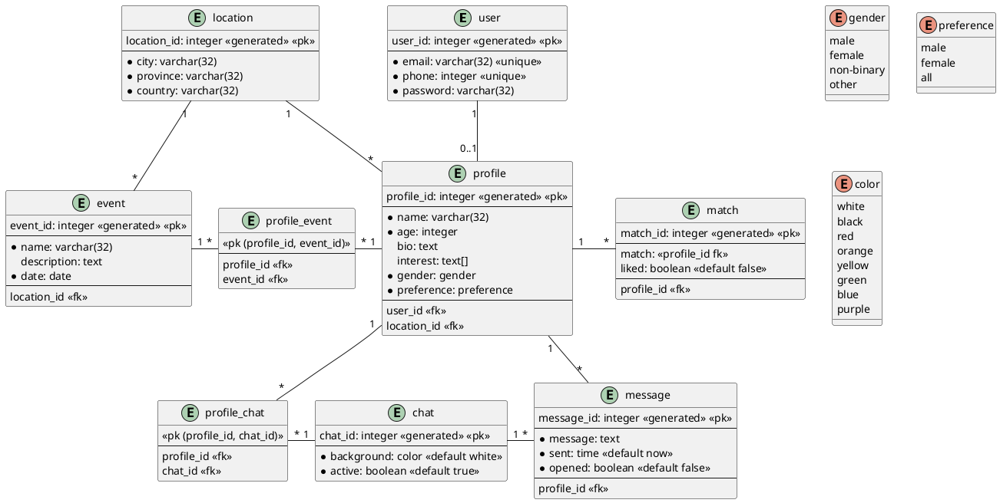

```plantuml
@startuml

entity user {
user_id: integer <<generated>> <<pk>>
--
*email: varchar(32) <<unique>>
*phone: integer <<unique>>
*password: varchar(32)
}

entity profile {
profile_id: integer <<generated>> <<pk>>
--
*name: varchar(32)
*age: integer
bio: text
interest: text[]
*gender: gender
*preference: preference
--
user_id <<fk>>
location_id <<fk>>
}

entity match {
match_id: integer <<generated>> <<pk>>
--
match: << profile_id fk>>
liked: boolean <<default false>>
--
profile_id <<fk>>
}

entity location {
location_id: integer <<generated>> <<pk>>
--
*city: varchar(32)
*province: varchar(32)
*country: varchar(32)
}

entity chat {
chat_id: integer <<generated>> <<pk>>
--
*background: color <<default white>>
*active: boolean <<default true>>
}

entity message {
message_id: integer <<generated>> <<pk>>
--
*message: text
*sent: time <<default now>>
*opened: boolean <<default false>>
--
profile_id <<fk>>
}

entity event {
event_id: integer <<generated>> <<pk>>
--
*name: varchar(32)
description: text
*date: date
--
location_id <<fk>>
}

entity profile_event {
<<pk (profile_id, event_id)>>
--
profile_id <<fk>>
event_id <<fk>>
}

entity profile_chat {
<<pk (profile_id, chat_id)>>
--
profile_id <<fk>>
chat_id <<fk>>
}

enum gender {
male
female
non-binary
other
}

enum preference {
male
female
all
}

enum color {
white
black
red
orange
yellow
green
blue
purple
}

user "1"--"0..1" profile:"         "

profile "1"--"*" profile_chat

profile_chat "*"-"1" chat

chat "1"-"*" message

profile "1"--"*" message

location "1 "--" * " profile

profile_event "*"-"1" profile

event "1"-"*" profile_event

location "1"--"*" event

profile "1"-"*" match:"      "

@enduml
```
